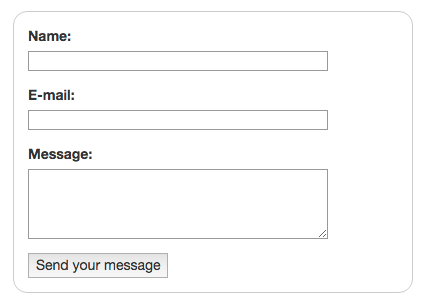
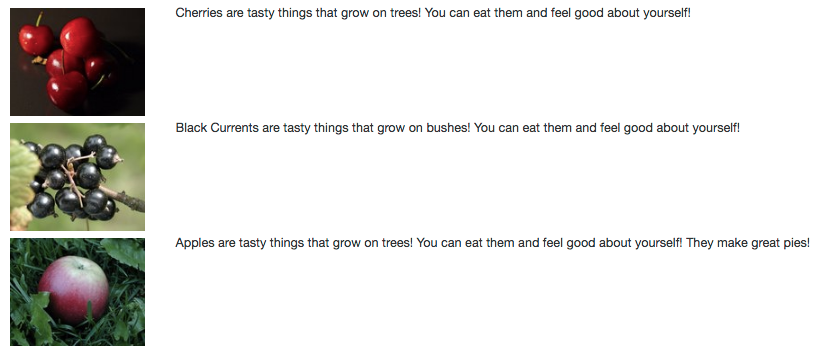

# Well of HTML

* * *

## Markup Language

From Wikipedia: HyperText Markup Language, commonly referred to as HTML, is the standard markup language used to create web pages. Web browsers can read HTML files and render them into visible or audible web pages. HTML describes the structure of a website semantically along with cues for presentation, making it a markup language, rather than a programming language.

What's a markup language? [](https://en.wikipedia.org/wiki/Markup_language)It's a language designed to mark off sections of a document or "page".

Take any newspaper or magazine page: how would you mark off or section off the parts of the page? What about the parts of a paragraph?

## HTML: Structure & Content

HTML elements are used to describe the structure of the page (e.g. headings, sub-headings, paragraphs). They also provide semantic information (e.g. where emphasis should be placed, the definition of any acronyms used, when given text is a quotation).

## The Skinny on HTML

*   HTML uses tags (characters that sit inside angled brackets) to give the information (content) they surround special meaning.
*   Tags are often referred to as elements.
*   Tags usually come in pairs.
*   The opening tag denotes the start of a piece of content; the closing tag denotes the end.
*   Opening tags can carry attributes, which tell us more about the content of that element.
*   Attributes require a name and a value, also called a key-value pair.
*   To learn HTML you need to know what tags are available for you to use, what they do, and where they can go. HTML uses tags (characters that sit inside angled brackets) instead of hash mark and asterisk.
*   Tags are turned into DOM elements by browser.

## HTML Expresses Hierarchical Relationships : Indentation Matters!!!

HTML elements can have nested elements, forming a parent to child hierarchical relationship. A paragraph can contain a hyperlink or a page section or division can contain another section or division, or even a list. In fact, a list can even contain another list. When we nest elements like this, we MUST indent them, like so:

```html
<body>
    <div id="container" class="container">
        <p>
            This paragraph tag belongs to the div tag with id "container", and the div tag belongs to the body tag!
        </p>
    </div
</body>
```

_NOTICE_ now each tag in the above example is indented by one tab (four spaces) to visually express the parent/child relationships! Always properly indent your HTML!

* * *

## [Setup](#setup)

1. [ ] In the root directory of well-of-html, open the file named `index.html`, and within the `<body>` tag, you'll find a `<div>` and two comments stating your markup will be inserted below and above here. You will insert your HTML between these comments:

```html
<body>
    <div id="container" class="container">
        <!-- ALL YOUR MARKUP GOES BELOW HERE -->


        <!-- ALL YOUR MARKUP GOES ABOVE HERE -->
    </div>
    <!-- other html... -->
```

_NOTE:_ If you'd like to add CSS styling rules to your markup, you can do so in the `<style>` tag, located in the `<head>` tag of the `index.html` page.

* * *

## Exercise 1 : Creating Markup

### 1.0 Anchor (aka Hyperlink)

Anchor tags, or the a tag, allow us to create hyperlinks to other sections of our page or to other webpages or files.

1.  [ ] Create a hyperlink using the anchor tag, `<a href="google.com"></a>`: set its `href` attribute to your favorite WIKI article.

* * *

### 1.1 Images

Image tags are one of HTML tags that do not require a closing tag, but can be closed with simply a slash at the end of the tag.


1.  [ ] Create an image tag, using one of the images in the directory `img/cherries.jpg` as the `src` attribute of the img tag, as in, ``. Notice the slash before the end of the img tag: `/>`

* * *

### 1.2 Headings

1.  [ ] Create text headings using tags `<h1></h1>` through `<h6></h6>`.
2.  [ ] Bonus, use Bootstrap `<small></small>` within a header!

* * *

### 1.3 Paragraphs

1.  [ ] Create some paragraphs with text using `<p></p>`.

* * *

### 1.4 Bold, Italics, and Emphasis

1.  [ ] Within a paragraph, add bold, italics, and emphasis with `<b></b>`, `<i></i>` or `<em></em>`, or `<strong></strong>`.

* * *

### 1.5 Lists

Ordered, unordered, and definition.

1.  [ ] Create a `<ul></ul>`, with several `<li></li>`.
2.  [ ] Create a `<ol></ol>`, with several `<li></li>`.

#### Definition Lists
```html
<dl>
  <dt>Canada</dt>
  <dd>A very cold country</dd>
  <dt>Brazil</dt>
  <dd>A very warm country</dd>
</dl>
```

* * *

### 1.6 Forms

Forms are the bread and butter of the Internet. You can't swap out your credit card without a form!

[Here's a really great getting started guide to forms...](https://developer.mozilla.org/en-US/docs/Web/Guide/HTML/Forms/My_first_HTML_form)



Here's the HTML and CSS for the above form:

**Form HTML:**
```html
<form class="example-form">
    <div>
        <label for="name">Name:</label>
        <input type="text" id="name" />
    </div>
    <div>
        <label for="mail">E-mail:</label>
        <input type="email" id="mail" />
    </div>
    <div>
        <label for="msg">Message:</label>
        <textarea id="msg"></textarea>
    </div>

    <div class="button">
        <button type="submit">Send your message</button>
    </div>
</form>
```

**Form CSS:**
```css
.example-form {
    /* Just to center the form on the page, use: margin: 0 auto;*/
    margin: 20px;
    width: 400px;
    /* To see the outline of the form */
    padding: 1em;
    border: 1px solid #CCC;
    border-radius: 1em;
}

.example-form div + div {
    margin-top: 1em;
}

.example-form label {
    /* To make sure that all labels have the same size and are properly aligned */
    display: inline-block;
    width: 90px;
}

.example-form input,
.example-form textarea {
    /* To make sure that all text fields have the same font settings
    By default, textareas have a monospace font */
    font: 1em sans-serif;
    /* To give the same size to all text field */
    width: 300px;
    -moz-box-sizing: border-box;
    box-sizing: border-box;
    /* To harmonize the look & feel of text field border */
    border: 1px solid #999;
}

.example-form input:focus,
.example-form textarea:focus {
    /* To give a little highlight on active elements */
    border-color: #000;
}

.example-form textarea {
    /* To properly align multiline text fields with their labels */
    vertical-align: top;
    /* To give enough room to type some text */
    height: 5em;
    /* To allow users to resize any textarea vertically
    It does not work on every browsers */
    resize: vertical;
}
```

* * *

1.  [ ] Create a `<form></form>`, with several different types of `<inputs/>`.

* * *

### 1.7 Tables

Tables are designed for expressing tabular data - data you'd find in a spreadsheet. They are not designed for layout - for layout, we use CSS.

<table>

<thead>

<tr>

<th>First Name</th>

<th>Last Name</th>

</tr>

</thead>

<tfoot>

<tr>

<td colspan="2">Names of students in class of 2020...</td>

</tr>

</tfoot>

<tbody>

<tr>

<td>Bob</td>

<td>Harrison</td>

</tr>

<tr>

<td>Judy</td>

<td>Dorsy</td>

</tr>

</tbody>

</table>

Here's the HTML and CSS for the above table:

**Table HTML:**
```html
<table>
    <thead>
        <tr>
            <th>First Name</th>
            <th>Last Name</th>
        </tr>
    </thead>
    <tfoot>
        <tr>
            <td colspan="2">Names of students in class of 2020...</td>
        </tr>
    </tfoot>
    <tbody>
        <tr>
            <td>Bob</td>
            <td>Harrison</td>
        </tr>
        <tr>
            <td>Judy</td>
            <td>Dorsy</td>
        </tr>
    </tbody>
</table>
```

**Table CSS:**

```css
table {
    margin: 20px;
}

table,
th,
td {
    padding: 4px;
    border: 1px solid black;
}
```

* * *

1.  [ ] Create a `<table></table>`, with several `<tr></tr>`, each with the same number of `<td></td>`.
2.  [ ] Bonus: Create headers for your table using `<th></th>`. See [W3 Schools: tables...](http://www.w3schools.com/html/html_tables.asp)

* * *

### 1.8 Div

A `<div></div>` tag represents a document division, a way by which we can section off the page and group content. You'll use divs alot to invisibly group elements and content!

1.  [ ] Create 5 `<div></div>` tags, and put some content, text, or another HTML element within each `div`.

* * *

### 1.9 Layout

You're going to need to layout stuff, sometimes in complex ways, so here's a primer on practical layout.

Layout is accomplished using CSS - styling rules that describe how the elements on the page should appear, including how they should be laid out.

We'll exemplify using Flexbox and Bootstrap's Grid CSS.

* * *

#### Flexbox

[Reference: Flexbox](https://css-tricks.com/snippets/css/a-guide-to-flexbox/)

Let's say we have some <cod>div</cod> tags with content and we wanted to layout these divs in a row - normally, HTML elements will stack vertically, one on top of the other, but we want our row to flow from left to right across the page.


* * *

Here's the HTML and CSS for the above Flexbox layout:

**Flexbox Row Example HTML:**
```html

<div class="flex-row">
    <div>One</div>
    <div>Two</div>
    <div>Three</div>
    <div>Four</div>
    <div>Five</div>
</div>
```

**Flexbox Row Example CSS:**
```css
.flex-row {
    display: flex;
    flex-direction: row;
    justify-content: space-between;
    margin: 20px;
    padding: 4px;
}
```

* * *

1.  [ ] Create a row-like Flexbox layout by creating and using a "flex-row" class.

* * *

#### Bootstrap Grid

Bootstrap is a CSS framework released by Twitter, it is installed in the `index.html` page of the well-of-html project, so we can immediately make use of it by applying CSS classes to HTML elements. Bootstrap comes with a very decent grid system. [Reference: Bootstrap Grid](http://getbootstrap.com/css/#grid)

Let's say we want to have some images next to a description, and divide grid in columns relatively by 2 and 10.



* * *

Here's the HTML and CSS for the above Bootstrap Grid layout:

**Bootstrap Grid Example HTML:**
```html
<div class="example-grid">
  <div class="row">
      <div class="col-md-2"></img>
      </div>
      <div class="col-md-10">Cherries are tasty things that grow on trees! You can eat them and feel good about yourself!</div>
  </div>
  <div class="row">
      <div class="col-md-2"></img>
      </div>
      <div class="col-md-10">Black Currents are tasty things that grow on bushes! You can eat them and feel good about yourself!</div>
  </div>
  <div class="row">
      <div class="col-md-2"></img>
      </div>
      <div class="col-md-10">Apples are tasty things that grow on trees! You can eat them and feel good about yourself! They make great pies!</div>
  </div>
</div>
```

**Bootstrap Grid Example CSS:**
```css
.example-grid {
    margin: 20px;
}

.row-img {
    margin: 4px;
}
```

* * *

1.  [ ] Create a Bootstrap grid-like layout.

* * *

### All Done!

Fantastic, you're all done with Well of HTML! You can close this page.

* * *
